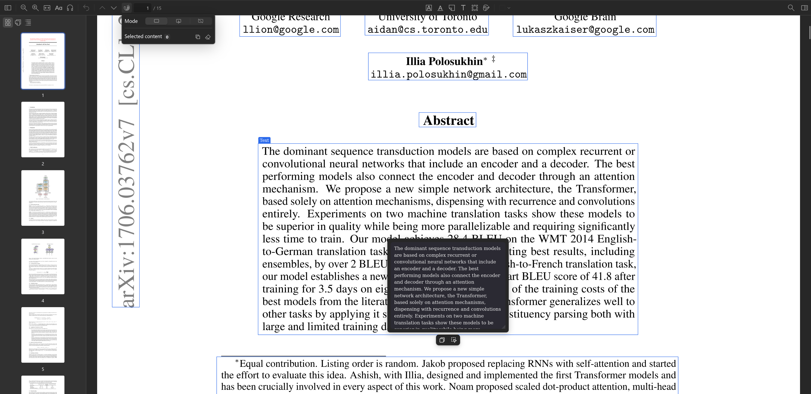

# MinerU for Zotero

[](https://www.zotero.org)
[](https://github.com/windingwind/zotero-plugin-template)

<p align="center">
    
</p>

[中文文档](README_zh.md)

MinerU for Zotero helps you parse Zotero PDF attachments with MinerU and copy layout-aware content directly from the Zotero PDF Reader.

## What You Can Do

<video src="assets/demo.mp4" controls></video>

- Parse one or more selected PDF attachments from the Zotero item list.
- Reuse an existing parse result, or reparse and replace it when needed.
- Show MinerU boxes in the Zotero PDF Reader.
- Switch between all boxes, hovered boxes, and off mode.
- Copy a single text, title, list, table, image caption, reference, formula, or other recognized box.
- Select multiple boxes with `Shift` or `Ctrl`, then copy them together in reading order.
- Copy the full parsed Markdown from the reader toolbar when no boxes are selected.
- Optionally save images from MinerU results into the local result folder.

## Requirements

- Zotero 8 or 9.
- A MinerU API Key.
- PDF attachments that are available on this computer.

## Setup

1. Install the plugin in Zotero.
2. Open `Edit` -> `Settings` -> `MinerU for Zotero`.
3. Enter your MinerU API Key.
4. Optional: enable `Save parsed result images` if you want images from MinerU results to be saved locally.

The API Key is stored only in local Zotero preferences.

## Parse a PDF

1. In the Zotero item list, select one or more PDF attachments.
2. Right-click the selection and choose `Parse PDF with MinerU`.
3. Wait until Zotero shows `MinerU parsing finished`.
4. Open the parsed PDF in the Zotero PDF Reader.

If a selected PDF already has a parse result, choose one of these options:

- `Use existing result`: keep the current result and use it in the reader.
- `Reparse and overwrite`: submit the PDF again and replace the result after parsing succeeds.

If parsing fails during replacement, the existing usable result is kept.

## Copy in the Reader

1. Open a parsed PDF.
2. Click the `MinerU boxes` button in the PDF Reader toolbar.
3. Choose a mode:
   - `Show all boxes`
   - `Show only hovered box`
   - `Disable plugin features`
4. Hover over a box and click `Copy`.
5. For formulas, choose `Copy with $` or `Copy without $`.

For multi-box copying, hold `Shift` or `Ctrl` while clicking boxes. Then use the toolbar menu to copy the selected content or clear the selection. If no boxes are selected, the same copy button copies the full parsed Markdown.

## Local Results

Open `Edit` -> `Settings` -> `MinerU for Zotero` and click `Open Data Folder` to view local parse results. The settings page also shows how many PDFs currently have usable results.

The result folder contains the parsed Markdown, box data used by the reader, and optional images. External tools may read these files, but editing them is not recommended.

## Local Markdown Query API

The local source query API lets local external tools read saved MinerU Markdown or an on-demand arXiv LaTeX source through Zotero's built-in local HTTP server. It does not submit new MinerU parsing jobs or directly expose the plugin data folder.

Main capabilities:

- Search candidate Zotero items and PDF attachments by title keywords.
- Read Markdown for a regular Zotero item or PDF attachment with `libraryID + key`.
- Query at `full`, `headings`, `section`, or `search` granularity, so external agents can inspect structure before reading a section or keyword context.
- Read numbered or fuzzy-matched sections, query tables by caption or content, and fetch saved images referenced as `images/...`.
- Pass `attachmentKey` to select a specific PDF when a regular item has multiple PDF attachments.
- Return precise Markdown first; if precise output is unavailable but lite output exists, return lite Markdown and mark it in `result.mode`.

Compatibility note: `granularity=section` now returns grouped results under `groups`. Use `sectionNumber` for numbered headings and fuzzy `sectionPath` for partial heading/path matching. Tables are available from `/mineru-for-zotero/markdown/table`; images referenced as `images/...` are available from `/mineru-for-zotero/markdown/image`. The `/image` endpoint returns JSON `images` results with base64 `dataURL` values for both single and comma-separated image paths.

### Configuration

1. Start Zotero and make sure MinerU for Zotero is enabled.
2. Open `Edit` -> `Settings` -> `MinerU for Zotero`.
3. In `Local Query API`, enable `Enable local Markdown query API`.
4. `Require token` controls whether callers must provide a token. When it is enabled, click `Generate token`.
5. When token validation is enabled, callers can send the token in the `Authorization: Bearer <token>` header. The API also supports a `token=<token>` query parameter.

Zotero's local port is usually `23119`. If you changed Zotero's local server port, replace the port in the examples below with your actual port.

### HTTP Examples

Search candidate items by title:

```shell
curl --get "http://127.0.0.1:23119/mineru-for-zotero/search" \
  --data-urlencode "libraryID=1" \
  --data-urlencode "title=retrieval augmented generation" \
  -H "Authorization: Bearer <token>"
```

Read the full Markdown:

```shell
curl "http://127.0.0.1:23119/mineru-for-zotero/markdown/read?libraryID=1&key=ABCD1234" \
  -H "Authorization: Bearer <token>"
```

Read only the heading hierarchy:

```shell
curl "http://127.0.0.1:23119/mineru-for-zotero/markdown/read?libraryID=1&key=ABCD1234&granularity=headings" \
  -H "Authorization: Bearer <token>"
```

Read a specific section:

```shell
curl --get "http://127.0.0.1:23119/mineru-for-zotero/markdown/read" \
  --data-urlencode "libraryID=1" \
  --data-urlencode "key=ABCD1234" \
  --data-urlencode "granularity=section" \
  --data-urlencode "sectionNumber=5.1,5.3-5.5" \
  -H "Authorization: Bearer <token>"
```

Search Markdown and return surrounding paragraphs:

```shell
curl --get "http://127.0.0.1:23119/mineru-for-zotero/markdown/read" \
  --data-urlencode "libraryID=1" \
  --data-urlencode "key=ABCD1234" \
  --data-urlencode "granularity=search" \
  --data-urlencode "q=retrieval" \
  --data-urlencode "contextParagraphs=2" \
  -H "Authorization: Bearer <token>"
```

Find tables by caption or cell content:

```shell
curl --get "http://127.0.0.1:23119/mineru-for-zotero/markdown/table" \
  --data-urlencode "libraryID=1" \
  --data-urlencode "key=ABCD1234" \
  --data-urlencode "q=Table 2" \
  --data-urlencode "match=both" \
  --data-urlencode "tableFormat=markdown" \
  -H "Authorization: Bearer <token>"
```

Fetch a saved image referenced by Markdown with the CLI:

```shell
node mineru-for-zotero-cli/scripts/query-source.mjs markdown image \
  --library-id 1 --key ABCD1234 --path images/a.jpg \
  --token "<token>" --output a.jpg
```

The `/image` endpoint returns JSON for single and multiple paths. Each successful image includes a base64 `dataURL`; the CLI decodes it when saving the file.

Common parameters:

| Parameter           | Endpoint                                | Description                                                          |
| ------------------- | --------------------------------------- | -------------------------------------------------------------------- |
| `libraryID`         | `search`, `markdown`, `tables`, `image` | Zotero library ID. Personal libraries are usually `1`.               |
| `title`             | `search`                                | Title keyword used to find candidate Zotero items.                   |
| `key`               | `markdown`, `tables`, `image`           | Zotero regular item key or PDF attachment key.                       |
| `attachmentKey`     | `markdown`, `tables`, `image`           | Selects the target PDF attachment when a regular item contains PDFs. |
| `granularity`       | `markdown`                              | `full`, `headings`, `section`, or `search`. Defaults to `full`.      |
| `sectionNumber`     | `markdown`                              | Numbered section query for `section`, for example `5.1,5.3-5.5`.     |
| `sectionPath`       | `markdown`                              | Fuzzy heading or path fragments for `section` queries.               |
| `q`                 | `markdown`, `tables`                    | Keyword used by Markdown search or table queries.                    |
| `contextParagraphs` | `markdown`                              | Number of context paragraphs around each `search` match.             |
| `match`             | `tables`                                | Table matching mode: `caption`, `content`, or `both`.                |
| `tableFormat`       | `tables`                                | Table output format: `html`, `markdown`, `tsv`, `latex`, or `json`.  |
| `path`              | `image`                                 | Image path such as `images/a.jpg`, or comma-separated image paths.   |

Common error codes:

- `api-disabled`: the local Markdown query API is not enabled in settings.
- `invalid-token`: the token is missing or does not match.
- `ambiguous-attachment`: the regular item has multiple PDFs; pass `attachmentKey`.
- `parse-result-not-found`: the target PDF has no usable parse result yet; parse it in Zotero first.
- `section-not-found`: the section path does not match; run `granularity=headings` first to inspect exact paths.
- `missing-query`: `granularity=search` was used without `q`.

### Companion Skill and CLI

The repository includes a companion Skill in `mineru-for-zotero-cli/`. It is intended for Codex or other local agents and wraps HTTP parameters, token headers, port detection, error hints, and readable text formatting. It has the same preconditions as the HTTP API: Zotero is running and the plugin's local Markdown query API is enabled. If the settings page requires a token, pass `--token <token>`.

Run the CLI from the repository root:

```shell
node mineru-for-zotero-cli/scripts/query-source.mjs search --library-id 1 --title "paper title" --token "<token>"
node mineru-for-zotero-cli/scripts/query-source.mjs markdown read --library-id 1 --key ABCD1234 --granularity headings --token "<token>"
node mineru-for-zotero-cli/scripts/query-source.mjs markdown read --library-id 1 --key ABCD1234 --granularity section --section-number "5.1,5.3-5.5" --token "<token>"
node mineru-for-zotero-cli/scripts/query-source.mjs markdown read --library-id 1 --key ABCD1234 --granularity search --query "retrieval" --context-paragraphs 2 --token "<token>"
node mineru-for-zotero-cli/scripts/query-source.mjs markdown table --library-id 1 --key ABCD1234 --query "Table 2" --match both --table-format markdown --token "<token>"
node mineru-for-zotero-cli/scripts/query-source.mjs markdown image --library-id 1 --key ABCD1234 --path "images/a.jpg" --output a.jpg --token "<token>"
node mineru-for-zotero-cli/scripts/query-source.mjs markdown read --library-id 1 --key ABCD1234 --granularity full --format json --token "<token>"
```

LaTeX commands use the arXiv ID stored in the Zotero item's `extra` or `url`. Fetch the decompressed source first; an unversioned ID downloads the latest version, while an ID such as `arXiv:2401.12345v2` downloads that version:

```shell
node mineru-for-zotero-cli/scripts/query-source.mjs latex fetch --library-id 1 --key ABCD1234 --token "<token>"
node mineru-for-zotero-cli/scripts/query-source.mjs latex read --library-id 1 --key ABCD1234 --granularity headings --token "<token>"
node mineru-for-zotero-cli/scripts/query-source.mjs latex read --library-id 1 --key ABCD1234 --granularity section --section-path "Main Results" --token "<token>"
node mineru-for-zotero-cli/scripts/query-source.mjs latex read --library-id 1 --key ABCD1234 --granularity search --query "attention" --token "<token>"
node mineru-for-zotero-cli/scripts/query-source.mjs latex table --library-id 1 --key ABCD1234 --query "Table 2" --token "<token>"
node mineru-for-zotero-cli/scripts/query-source.mjs latex image --library-id 1 --key ABCD1234 --path figures/model.pdf --output model.pdf --token "<token>"
node mineru-for-zotero-cli/scripts/query-source.mjs latex image --library-id 1 --key ABCD1234 --path imgs/one.pdf,imgs/two.pdf --output-dir extracted --token "<token>"
```

For CLI commands, `--library-id` is required for every command and `--key` is required for every `markdown` and `latex` command. LaTeX sections require `--section-path`: use a case-insensitive exact full heading path separated by `/`, or a unique final title. LaTeX does not support `--section-number`, number ranges, or fuzzy path fragments. LaTeX search requires a non-empty `--query` and accepts `--context-paragraphs` (default `1`); matches report the source file and line. The `--table-format` option is available only for `markdown table`; `latex table` always returns the original LaTeX code and does not accept it.

`latex table` always returns the original LaTeX table code. Use `latex fetch --refresh` to replace the stored source with a newly downloaded version.

The CLI tries to read Zotero's local HTTP server port from the default Zotero profile. If it cannot, it uses `23119`. Add `--port <number>` to set the port manually. The default output is `--format text`, which is easier for agents to read directly. Use `--format json` for scripts and pipelines.

For `image`, use `--output <file>` for a single path. For multiple comma-separated paths, use `--output-dir <dir>` so each image is written under that directory. LaTeX image output preserves source subdirectories such as `imgs/` and `logo/`; each requested path has its own status, duplicate paths are written once, and a partial failure returns a nonzero exit code while retaining successful files. Text and JSON output never include image base64 data. An ambiguous LaTeX section title returns candidate full paths; a missing section returns `section-not-found`.

## MCP Query Service

If an MCP client cannot run the Node CLI, connect it directly to the plugin's stateless Streamable HTTP MCP endpoint. It uses Zotero's existing local HTTP server and does not start another process or port:

```text
http://127.0.0.1:23119/mineru-for-zotero/mcp
```

Enable `Local Markdown Query API` in the plugin settings first. If token validation is enabled, add an `Authorization: Bearer <token>` header in the MCP client configuration. Replace `23119` when Zotero uses another local HTTP server port.

For clients that support URL MCP servers, a configuration can look like this:

```json
{
  "mcpServers": {
    "mineru-for-zotero": {
      "url": "http://127.0.0.1:23119/mineru-for-zotero/mcp",
      "headers": {
        "Authorization": "Bearer <token>"
      }
    }
  }
}
```

The endpoint exposes `zotero_search_items`, `mineru_read_markdown`, `mineru_query_markdown_table`, `mineru_get_markdown_image`, `mineru_fetch_latex`, `mineru_read_latex`, `mineru_query_latex_table`, and `mineru_get_latex_image`. Query tools return both structured data and readable text; image tools also return MCP image content blocks. The service is stateless, so each JSON-RPC request is independent, and the endpoint is removed when the plugin shuts down.

## Troubleshooting

### API Key Not Configured

Open the plugin settings page, enter your MinerU API Key, and try again.

### File Access Failed

Make sure the PDF is available locally. If the attachment is cloud-only or still syncing, open or download it in Zotero first.

### The Reader Says No Parse Result Is Available

Parse the PDF first. If you already parsed it, open the data folder from the settings page and confirm that the parsed result still exists.

### Boxes Are Not Visible

Confirm that the toolbar mode is not set to `Disable plugin features`. If the PDF was parsed but still has no boxes, reparse it.

### Result Download Failed

The MinerU result download may be temporarily unavailable. Try again later or reparse the PDF.

## Development

Install dependencies:

```shell
npm install
```

Start development mode:

```shell
npm start
```

Run tests, checks, and build:

```shell
npm test
npm run lint:check
npm run build
```

## License

AGPL-3.0-or-later
