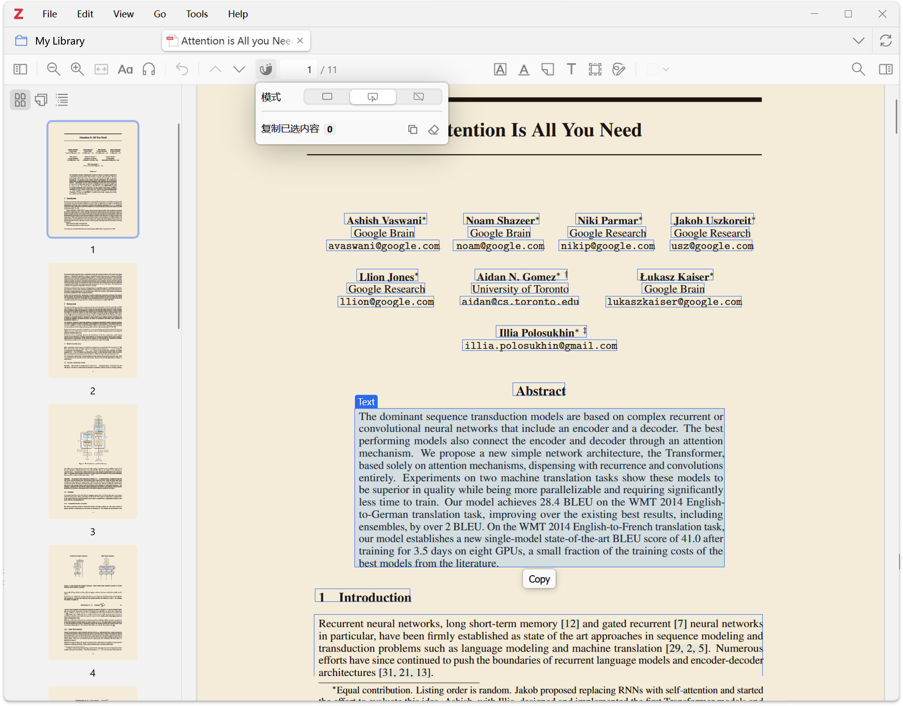

# MinerU for Zotero

[](https://www.zotero.org)
[](https://github.com/windingwind/zotero-plugin-template)

<p align="center">
    
</p>

[English Document](README.md)

MinerU for Zotero 可以帮你在 Zotero 中调用 MinerU 解析 PDF attachment，并在 Zotero PDF Reader 里按版面区域复制内容。

## 可以做什么

<video src="assets/demo.mp4" controls></video>

- 从 Zotero 条目列表中解析一个或多个已选 PDF attachment。
- PDF 已有解析结果时，可以直接使用已有结果，也可以重新解析并覆盖。
- 在 Zotero PDF Reader 中显示 MinerU box。
- 支持显示全部 box、仅显示鼠标所在 box、关闭插件功能三种模式。
- 支持复制单个文本、标题、列表、表格、图片标题、引用、公式等区域。
- 按住 `Shift` 或 `Ctrl` 选择多个 box 后，可按阅读顺序合并复制。
- 未选择 box 时，可从 Reader 工具栏复制全文 Markdown。
- 可选保存 MinerU 解析结果中的图片到本地结果目录。

## 使用前准备

- Zotero 8 或 9。
- MinerU API Key。
- PDF attachment 已经在当前电脑本地可用。

## 设置

1. 在 Zotero 中安装插件。
2. 打开 `编辑` -> `设置` -> `MinerU for Zotero`。
3. 填入 MinerU API Key。
4. 可选：开启 `保存解析结果图片`，将 MinerU 结果中的图片保存到本地。

API Key 只保存在本机 Zotero 首选项中。

## 解析 PDF

1. 在 Zotero 条目列表中选择一个或多个 PDF attachment。
2. 右键点击选中项，选择 `使用 MinerU 解析 PDF`。
3. 等待 Zotero 提示 `MinerU 解析完成`。
4. 在 Zotero PDF Reader 中打开已解析的 PDF。

如果选中的 PDF 已有解析结果，插件会让你选择：

- `使用已有结果`：保留当前结果，直接在 Reader 中使用。
- `重新解析并覆盖`：重新提交 PDF，解析成功后替换旧结果。

如果覆盖过程中失败，已有的可用结果会被保留。

## 在 Reader 中复制

1. 打开已解析 PDF。
2. 点击 PDF Reader 工具栏中的 `MinerU box` 按钮。
3. 选择模式：
   - `显示全部 box`
   - `仅显示鼠标所在 box`
   - `关闭插件能力`
4. 鼠标悬停到 box 上，点击 `复制`。
5. 公式区域可选择 `带 $ 复制` 或 `不带 $ 复制`。

需要复制多个区域时，按住 `Shift` 或 `Ctrl` 点击多个 box。随后可在工具栏菜单中复制已选内容或清空选择。没有选中任何 box 时，同一个复制按钮会复制全文 Markdown。

## 本地结果

打开 `编辑` -> `设置` -> `MinerU for Zotero`，点击 `打开数据文件夹` 可以查看本地解析结果。设置页也会显示当前已有可用结果的 PDF 数量。

结果目录中包含解析出的 Markdown、Reader 使用的 box 数据，以及可选保存的图片。外部工具可以读取这些文件，但不建议手动修改。

## 常见问题

### 提示未配置 API Key

进入插件设置页填写 MinerU API Key 后重试。

### 提示文件访问失败

确认 PDF 已在本地可用。对于只保存在云端或还在同步中的附件，请先在 Zotero 中打开或下载该 PDF。

### Reader 提示当前 PDF 没有可用解析结果

请先解析该 PDF。如果已经解析过，可以从设置页打开数据文件夹，确认本地结果仍然存在。

### Reader 中看不到 box

先确认工具栏模式不是 `关闭插件能力`。如果 PDF 已解析但仍看不到 box，可以重新解析。

### 结果下载失败

MinerU 结果下载可能暂时不可用。可以稍后重试，或重新解析该 PDF。

## 开发

安装依赖：

```shell
npm install
```

启动开发模式：

```shell
npm start
```

测试、检查和构建：

```shell
npm test
npm run lint:check
npm run build
```

## License

AGPL-3.0-or-later
